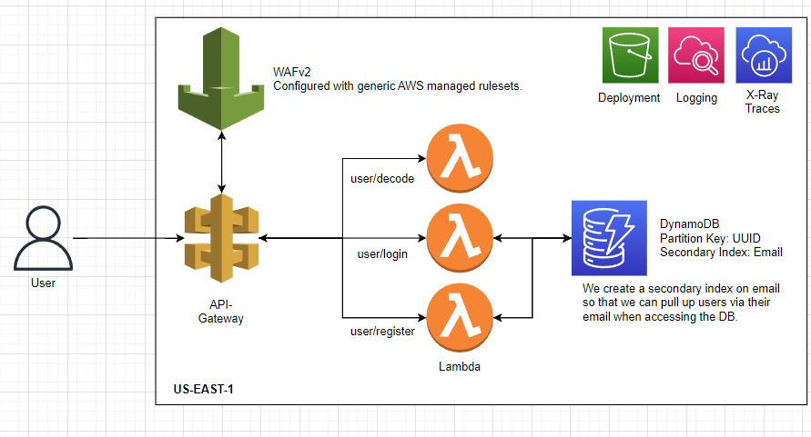
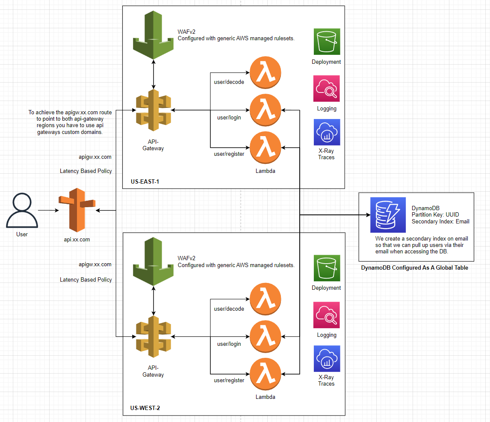

# AWS Serverless Auth(JWT) Template

> A template for starting an AWS based serverless api which integrates JWT authorization and user registration. This utilizes Lambda, api-gateway, WAFv2, and DynamoDB to build a scalable and highly-available rest api. Deployment of all infrastructure fully automated via serverless framework :)

## Architecture
Below is a single region deployment example. All resources here are automatically provisioned and configured via serverless framework and deployed to the configured region.
<br>

<br>
Below is a multi-region deployment for high availability in the unlikely event of an AWS regional failure. This also reduces geographic latency to each region deployed. To achieve this active-active behavior we must manually configure a `route53 zone` & `api gateway custom domains`. You then apply 2 `latency based` routing policies to point at each api gateaway via `A record`. Then attach health-checks to each policy to ensure that the services are healthy in that region. You will also need to configure DynamoDB to use a [global table](https://aws.amazon.com/dynamodb/global-tables/)
<br>


Alternatively you could setup a cloudfront distribution with an origin group that contains both api-gateways that fails over on 4xx-5xx. This active-passive pattern would also allow multi-region failover without the need of route53 or a custom domain.

## REST Documentation
### `POST /user/register`

Input: `body (json)`

```json
{
  email: String (must be valid format),
  username: String (under 20 characters),
  password: String
}
```
Example Output
```json
{
  status: "Successfully created user!",
  jwt: "xxxxxxxxxxxxxxxxx"
}
```
### `POST /user/login`

Input: `body (json)`

```json
{
  email: String (must be valid format),
  password: String
}
```
Example Output
```json
{
  status: "Successfully logged in.",
  jwt: "xxxxxxxxxxxxxxxxx"
}
```

### `POST /user/decode`

Input: `body (json)`

```json
{
  jwt: String (must be valid jwt)
}
```
Example Output
```json
{
  status: "Successfully validated JWT.",
  decodedJWT: {
    userid: "xxxxx-xxxx-xxx-x",
    email: "test@test.com",
    iat: 1691089483,
    exp: 1691175883
  }
}
```

## Adding new lambdas
Adding lambdas is fairly straight forward. Simply copy one of the lambda folders inside of `/src/lambdas/` and modify the handler code as needed. Note that the handler must return the callback and the data should be in a `json` format. Once that is complete open `serverless.yml` and navigate to the `functions:` section. This is where we specify the file to use in that lambda as well as how it connects to api-gateway. 

Example config:
```yaml
functions:
  hello:
    handler: src/lambdas/hello/handler.handler #fileName.exportName in code
    maximumRetryAttempts: 1 #Retry attempts by lambda on failure
    package: # Only package code relevant to this specific lambda
      patterns:
        - src/lambdas/hello/**
    events: #API Gateway integration etc
      - http:
          method: get
          path: hello
          private: true #require an api key (look below to usage-plans)
          cors: #cors settings
            origin: '*'
```

For more documentation on how its configured, visit [HERE](https://www.serverless.com/framework/docs/providers/aws/guide/functions).

## Adding Environment Variables
Environment variables can be added to our lambdas via `serverless.yml` under the `provider:`. An example is as follow:
```yaml
provider:
  environment:
    MY_SECRET: hi there :)
```
This will be accessible in the lambda via `process.env.MY_SECRET`. There are defaultly some environment variables accessible from AWS such as `process.env.AWS_REGION` for the current region

**Note**: Sensitive secrets should be stored via [Secret Manager](https://aws.amazon.com/secrets-manager/) which should be manually configured by you. To request secrets and data from the service you can utilize the [AWS SDK for JS](https://www.npmjs.com/package/aws-sdk) and follow this [example](https://www.internetkatta.com/how-to-use-secrets-manager-in-aws-lambda-node-js).

## Caching
There are a few methods to cache request. Api-Gateway has a built in caching mechanism & you can alternatively use something like elasticache for an app cache. For database caching there is also [DAX](https://aws.amazon.com/dynamodb/dax/) for a fairly high price.

## Configuring API Gateway & Limits
By default, our api-gateway service is public and is throttled through default burst and limits attached to the stage. However, you can alternatively create a `usage plan` for finer control and optionally attach it to specific api keys. A usage plan is a set of limits such as a `rate limit`, `burst limit`, and `quota`. You can modify the limits of this usage plan via the `serverless.yml` under the `apiGateway:` section. 

Example config:
```yaml
apiKeys:
    - private_key: # Used to tie key to usage plan
        - my amazing api key
usagePlan:
    - private_key: # Used to tie key to usage plan. Key will abide by the following
        quota:
            limit: 5000 #maximum 5000 request per month, refreshes on 2nd day
            offset: 2
            period: MONTH
        throttle:
            burstLimit: 200 #maximum number of concurrent requests that API gateway will serve at any given point
            rateLimit: 100 #request per second limit
```
More info on configuration options found [HERE](https://www.serverless.com/framework/docs/providers/aws/events/apigateway).

## Deployment
To deploy the application to AWS you will first need to install the [AWS CLI](https://docs.aws.amazon.com/cli/latest/userguide/getting-started-install.html). Then proceed with the following steps.

1. Authenticate with your AWS CLI. Whether that be entering access keys in the [credential file](https://docs.aws.amazon.com/cli/latest/userguide/cli-configure-files.html) or alternatively entering [environment variables](https://docs.aws.amazon.com/cli/latest/userguide/cli-configure-envvars.html).
2. Ensure all your unit test are passing with `npm test`
3. Run `npm deploy` which will use the default of stage `dev` and region `us-east-1`. If you wish to manually configure the stage and region, you can do so by modifying the `package.json` script or alternatively running `serverless deploy --stage dev --region us-east-1` manually with your respective changes to that commands parameters.

**IMPORTANT** : Due to the universal nature of s3, the deployment may fail with a "bucket already exist" error. This is because s3 buckets must have unique names _per region_. To resolve this ensure your service name is unique to your project or modify the deployment bucket name in the `serverless.yml` 

**IMPORTANT** : Upon first deployment, the script may not be able to attach the WAF to the API-Gateway. Simply rerun the deployment script and it should attach now that its created.

## Dev Dependencies
- serverless
- serverless-associate-waf
- serverless-deployment-bucket
- serverless-offline
- standard

## App Dependencies
- aws-sdk
- bcryptjs
- jsonwebtoken
- uuid
- yup

## Contributing
Find the contribution document [HERE](/CONTRIBUTING.md) if you wish to work on the repo!